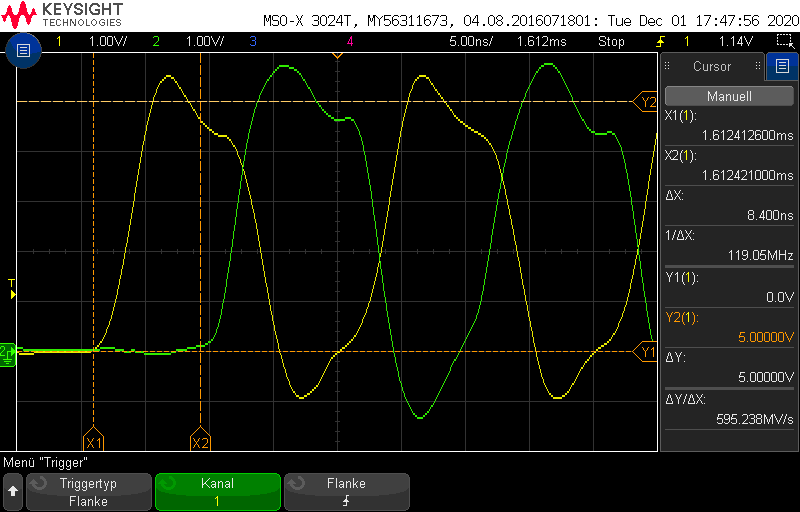
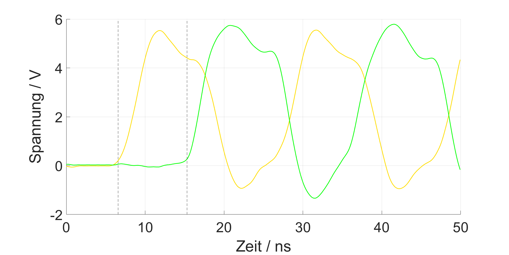

# plot Oscilloscope data
Matlab script to plot oscilloscope wave data from csv file exported from a Keysight Oscilloscope.
The generated plots can be modified and used in a paper, documentation or your Thesis.

## Features
- supports up to 5 Channels
- crop the view
- add horizontal and vertical lines
- name axis
- change x-axis unit (s , ms, us, ns)
- thoroughly commented code
- large amount of sample data

## Usage
This script has been developed for KEYSIGHT Oscilloscopes. But it may work for other Tools if you modify the importfile.m  

You can run this script without change, to verify it works on you system. It should display the plot in examples.

To use your own data, put your csv file in the OsziData folder (or anywhere else) and modify the path in the importfile() line in visualizeWaveData.m  

To crop the data modify the start and the stop variable.  
To add vertical and horizontal lines modify the values in the section "extra horizontal lines" and "extra vertical lines"

To save the generated plot, make the window fullscreen, as the size of the window determines the resolution of the resulting png. Before saving the image you can use all the features in the matlab GUI.  
To make the image choose save as png.   
png should be smaller then jpeg, as the background is simply white.  
You can also save as SVG

## example
lock into the FiguresOutput folder to see some examples
### Screenshot from Oscilloscope

### plot generated with this script

